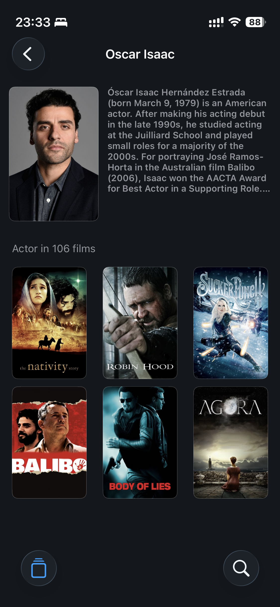
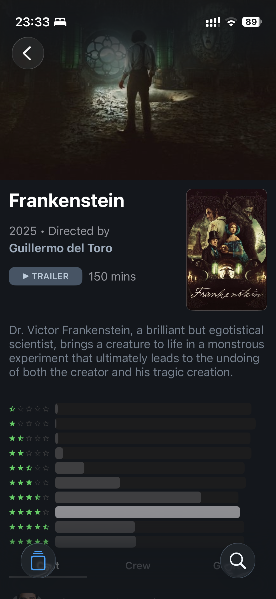
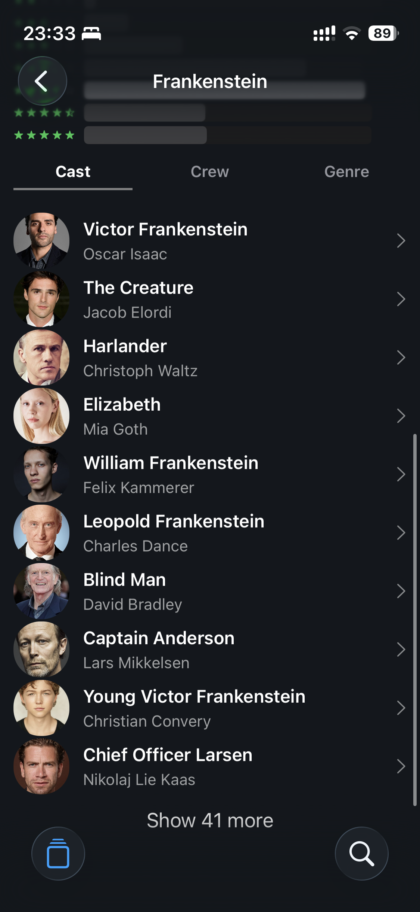

# 🎬 CinePulseine-Pulse
CinePulse is a modern and high-performance iOS app that uses the TMDB API to discover movies and actors. Users can browse popular movies, view detail pages, explore actor profiles, and find content with advanced search.

This project is a portfolio application focusing on MVVM, Combine, networking and modular architecture with Swif UIKit.

---

## 🚀 Features

- 🎥 **Movie lists** (popular, trending, upcoming)
- 🔎 **Advanced Search** (debounce + Combine)
- 🧑‍🎤  **Actor Detail Screen**
- 📄 **Movie Details Screen**
- 💾 **Image cache management** (Kingfisher)
- 🌗 **Dark Mode design**
- 🧱 **Modular MVVM + Combine architecture**
- 🔌 **TMDB API integration**
- 📱 **Fully programmatic UI**

## 🧩 Architectural and Technical Details

### **Architecture**
- MVVM pattern
- Combine with:
 - Debounce
 - Subject usage
 - Data binding
 - Publisher chains

### **Networking**
- URLSession + Combine
- Custom `NetworkManager`
- Type-safe endpoint structure
- Error handling + decoding strategies

### **UI**
- UIKit + Auto Layout
- Custom reusable views
- Programmatic layout

---

## 📁 Project Structure
```
Cine-Pulse/

├── Application/              # Application startup files
│   ├── AppDelegate.swift
│   └── SceneDelegate.swift
│
├── Models/                   # Data models (7 models)
│   ├── MovieListModel.swift
│   ├── MovieDetailModel.swift
│   ├── MovieCreditsModel.swift
│   ├── MovieRatingsModel.swift
│   ├── MovieVideoModel.swift
│   ├── PersonModel.swift
│   └── CombinedCreditsModel.swift
│
├── Networking/               # Network layer
│   ├── Core/
│   │   ├── BaseNetworking.swift    # Networking protocol and implementation
│   │   └── Endpoint.swift          # Endpoint protocol and HTTP methods
│   └── Services/
│       ├── TMDBEndpoint.swift      # TMDB API endpoints
│       └── TraktEndpoint.swift     # Trakt API endpoints
│
├── ViewModels/              # ViewModel layer (MVVM)
│   ├── Core/
│   │   └── BaseViewModel.swift     # Base class that all ViewModels inherit from
│   ├── HomeViewModel.swift
│   ├── DetailViewModel.swift
│   ├── AllMoviesViewModel.swift
│   ├── PersonDetailsViewModel.swift
│   └── SearchViewModel.swift
│
├── UI/                      # User interface layer
│   ├── MainTabView/
│   │   ├── CinePulseTabBarController.swift
│   │   └── TabItem.swift           # Tab bar configuration (Home, Search, Profile)
│   │
│   ├── Home/
│   │   ├── ViewControllers/
│   │   │   └── CinePulseViewController.swift
│   │   └── UIViews/
│   │       ├── MovieListView.swift
│   │       ├── Cells/
│   │       │   ├── MovieCategoryRowCell.swift
│   │       │   └── MoviesCollectionViewCell.swift
│   │       └── Buttons/
│   │           └── MovieCategoryNavigationButton.swift
│   │
│   ├── MovieDetails/
│   │   ├── ViewControllers/
│   │   │   └── MovieDetailsVC.swift
│   │   └── UIViews/
│   │       ├── DetailUIView.swift
│   │       ├── Cells/              # Collection view cells
│   │       ├── RatingChart/
│   │       └── StrechHeader/
│   │
│   ├── PersonDetails/
│   │   ├── ViewControllers/
│   │   │   └── PersonDetailViewController.swift
│   │   └── UIViews/
│   │       ├── PersonDetailUIView.swift
│   │       └── Cells/
│   │
│   ├── AllMovies/
│   │   ├── ViewControllers/
│   │   │   └── AllMoviesVC.swift
│   │   └── UIViews/
│   │       ├── AllMoviesView.swift
│   │       └── AllMoviesCollectionViewCell.swift
│   │
│   ├── SearchMovies/
│   │   └── ViewController/
│   │       └── SearchMoviesViewController.swift
│   │
│   └── ProfileView/
│       ├── ViewControllers/
│       │   └── ProfileViewController.swift
│       └── UIView/
│           ├── ProfileUIView.swift
│           └── ProfileTableViewCell.swift
│
├── Utilities/               # Helper classes and extensions
│   ├── Extensions/
│   │   ├── CollectionExtension.swift
│   │   ├── PosterFullScreenImage.swift
│   │   └── URLExtension.swift
│   ├── Helpers/
│   │   ├── MovieCategory.swift     # Movie categories enum
│   │   ├── DetailTab.swift
│   │   └── AspectRatio.swift
│   └── Protocols/
│       └── SelectedMovies.swift
│
├── ErrorHandling/           # Error handling
│   ├── NetworkingError.swift       # Network errors enum
│   └── MovieError.swift
│
├── Supports/                # Support files
│   ├── Assets.xcassets/     # Images, colors, fonts
│   ├── Fonts/               # Proxima Nova fonts
│   ├── Key.xcconfig
│   └── Secrets.swift        # API keys
│
└── CinePulseTests/         # Test files
    ├── MocTestData/
    │   └── MockNetworking.swift
    ├── NetworkingTest/
    │   └── BaseNetworkTests.swift
    └── ViewModelTests/
        └── HomeViewModelTests.swift
```

---

## 🔧 Technologies Used

- Swift 6.2.1
- UIKit
- Combine
- URLSession
- TMDB API
- AutoLayout (programatik)
- MVVM

---

## 🎯 Learning Objectives (Aimed by This Project)

- Implementing Combine in a real project
- Cleanly implementing the MVVM architecture
- Creating a product with a UI/UX flow
- Publishing an app that displays API-based content

---

## 📦 Upcoming Updates

- 🔧 Performance improvements
- 🐞 Minor bug fixes
- ⭐ New modules (optional)

Although this project is complete, maintenance and minor improvements will continue.

---

## 📸 Screenshots

<p float="left">
  
  
  
  
  
  
</p>


## 📝 License
This project is not open source; it is for portfolio purposes.
